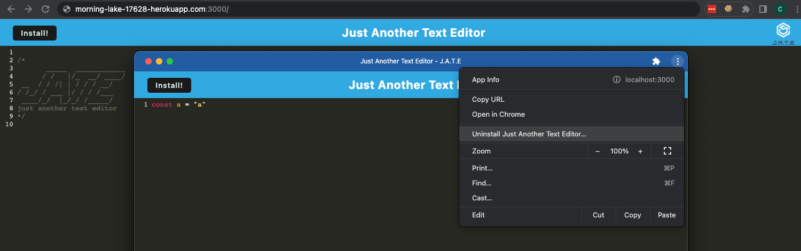

# PWA Text Editor
<div id="top"></div>

<!-- TABLE OF CONTENTS -->
<details>
  <summary>Table of Contents</summary>
  <ol>
    <li>
      <a href="#about-the-project">About The Project</a>
      <ul>
        <li><a href="#built-with">Built With</a></li>
      </ul>
    </li>
    <li>
      <a href="#getting-started">Getting Started</a>
      <ul>
        <li><a href="#prerequisites">Prerequisites</a></li>
        <li><a href="#installation">Installation</a></li>
      </ul>
    </li>
    <li><a href="#contact">Contact</a></li>

  </ol>
</details>


<!-- ABOUT THE PROJECT -->
## About The Project



This class project is to create a progressive web application (PWA) for a text-editor with syntax highlighting.

About:
* The text editor is build for JS and highlights syntax
* The Node based application is a PWA meaning it's installable with thick-client like properties  
* View in Chrome in a non-incognito browser session to install locally  

[Deployed Site](http://morning-lake-17628-herokuapp.com:3000/)

<p align="right">(<a href="#top">back to top</a>)</p>


### Built With

* [Node.js](https://nodejs.dev/)
* [Express.js](https://expressjs.com/)
* [Webpack](https://webpack.js.org/guides/getting-started/)


<p align="right">(<a href="#top">back to top</a>)</p>


<!-- GETTING STARTED -->
## Getting Started

To get a local copy up and running follow these simple example steps.

### Prerequisites

* npm
  ```sh
  npm install npm@latest -g
  ```


### Installation

1. Clone this repo 
    ```sh
    git clone git@github.com:anon123123123/du-text-editor-pwa.git
    ```
2. Install NPM packages
    ```sh
    cd du-text-editor-pwa && npm install
    ```
3. Start
    ```sh
    npm run start
    ```


<p align="right">(<a href="#top">back to top</a>)</p>


<!-- CONTACT -->
## Contact

Project Link: [https://github.com/anon123123123/du-text-editor-pwa](https://github.com/anon123123123/du-text-editor-pwa)

<p align="right">(<a href="#top">back to top</a>)</p>


